# like hearing an old song again

[](https://hackmd.io/GOVqFBANTQC8Fbuhv_LlBA)


its 2021, ten years since the 2020 blip, and 7 years since i first wrote about mermaid diagrams in 2014. i recently rediscovered mermaid while learning just how many great features hackmd provides. i've been having fun exploring all of mermaid's modern features in work collaboratively with my friends. we're all having fun with mermaid, its like hearing an old song for the time.

```mermaid
gantt
    mermaid :0d, 1d
    is :1d, 2d
    cool :1d
```

## diagrams with mermaid

mermaid is diagramming and charting tool in javascript. it produces `<svg>` figures using `d3`

you can explore the hackmd docs for all the cool extras they provide. we're just going to focus on mermaid. below we demonstrate a few different styles of diagrams that mermaid supports.


### Flowchart


### Sequence diagram


### Class Diagram


### State Diagram


### Entity Relationship Diagram


### User Journey


### Gantt


```mermaid
gantt
    mermaid :0d, 1d
    is :1d, 2d
    cool :1d
```


### Pie Chart

```mermaid
pie title mermaid
         "🧑‍🦰": 90
         "🐟" : 10
         
```




### Requirement Diagram

## can mermaid jupyter?

before our blip, the homie @bollwyvl had a `%%mermaid` magic that worked in the classic notebok. those were simpler times, and now we have `jupyterlab`, `mermaid` magic has been archived.

the new school does provide a cool `jupyter-markup` extension adds code fence directives like mermaid. some examples are show in the screenshots below.

TODO: screenshots

## why the lull?

i was curious to think about why mermaid feel out of my workflow even though it is such a righteous tool.

there are few things that attributed to this.

1. i use a conda and scientific python toolchain meaning that `graphviz` is used more often. `graphviz`'s dot syntax is tried and test, its a timeless song.
3. i hate `node` and i don't want a `node` runtime.
4. `jupyter` moved to a new framework and bolder intent that created a lot of friction between old and new tools. javascript became more difficult to hack.

i'm fairly certain i'll be using mermaid more frequently now that it works in newest `jupyterlab` ecosystem with the `jupyter-markup` extension.

## conclusion

mermaid is cool. markdown is cool. jupyter is cool. hackmd is cool. it is cool that they are all cool with each other. stay cool.


[first]: https://gist.github.com/tonyfast/b77d1cb766f65f026c67
    
    
    