---
---

# like hearing an old song again

[](https://hackmd.io/GOVqFBANTQC8Fbuhv_LlBA)


its 2021, ten years since the 2020 blip, and 7 years since i first wrote about [**mermaid** diagrams] in 2014.[^0] i recently [columbused]() **mermaid** while learning just how many great features hackmd provides. i've been having fun exploring all of [**mermaid**'s modern features] in collaborative work with my friends on hackmd. we're all having fun with **mermaid**. it feels like hearing an old song for the time; i keep playing it on repeat.

```mermaid
gantt
    mermaid :0d, 1d
    is :1d, 2d
    cool :1d
```

you can explore the [hackmd docs] for [all the cool features] they provide; *seriously y'all gotta take the time to brush up*. we're just going to focus on **mermaid**. 

## diagrams with **mermaid**

[**mermaid**] is a diagramming and charting tool in javascript. it produces `<svg>` figures in javascript using a [`d3`]-based library for directed graphs called [`dagre`]. same as 7 years ago, except now everything is likely typescript and :face_with_monocle: 

below is a list of the different charts and syntaxes used with **mermaid.**


### Flowchart

[Flowcharts](https://en.wikipedia.org/wiki/Flowchart) are good ways to represent workflows or processes.


### Sequence diagram

[Sequence diagrams](https://en.wikipedia.org/wiki/Sequence_diagram) are good for sharing interactions over time.


### Class Diagram

[Class diagrams](https://en.wikipedia.org/wiki/Class_diagram) can be used to visual object oriented programming interfaces.


### State Diagram

[State diagrams](https://en.wikipedia.org/wiki/State_diagram) can be defined to show how systems interact.


### Entity Relationship Diagram

[Entity relationship diagrams](https://en.wikipedia.org/wiki/Entity%E2%80%93relationship_model) are composed to illustrate the connecivity of knowledge.


### User Journey

[User journey's](https://en.wikipedia.org/wiki/User_journey) can describe a person's interaction with technology.


### Gantt

[Gantt charts](https://en.wikipedia.org/wiki/User_journey), named for Henry Gantt, show the relationship between activities and schedule

```mermaid
gantt
    mermaid :0d, 1d
    is :1d, 2d
    cool :1d
```


### Pie Chart

```mermaid
pie title mermaid
         "🧑‍🦰": 90
         "🐟" : 10
         
```

Lastly, [pie charts](https://en.wikipedia.org/wiki/Pie_chart) are mermaid feature *for making important business decision on big data and machine learning*.




### Requirement Diagram

## can mermaid jupyter?

before our blip, the homie [@bollwyvl] had a `%%mermaid` magic that worked in the classic notebok. those were simpler times, and now we have [`jupyterlab`], `mermaid` magic has been archived.[^1]

the new school does provide a cool [`jupyter-markup`] extension adds code fence directives like mermaid. some examples are shown in the screenshots below.

TODO: screenshots

## why the lull?


i was curious to think about why [mermaid] fell out of my toolbox, and i hadn't thought anything of it. :thinking_face: there are few things that attributed to this.

1. i use a conda and scientific python toolchain meaning that [`graphviz`] is used more often. `graphviz`'s dot syntax is tried and tested, its a timeless song.
3. i hate `node` and i don't want a `node` runtime in my waking or sleeping life.
4. `jupyter` shifted focus to new technologies with bolder intent that created friction between old and new tools. 
5. the saddest part is that javascript became more difficult to hack in a notebook in `jupyter`.

there is change in the wind and i'm fairly certain i'll be using mermaid more frequently now that it works in newest [`jupyterlab`] ecosystem with the [`jupyter-markup`] extension.

## conclusion

mermaid is cool. markdown is cool. jupyter is cool. hackmd is cool. it is cool that they are all cool with each other. stay cool. :sunglasses: 


[first]: https://gist.github.com/tonyfast/b77d1cb766f65f026c67
    
    
    